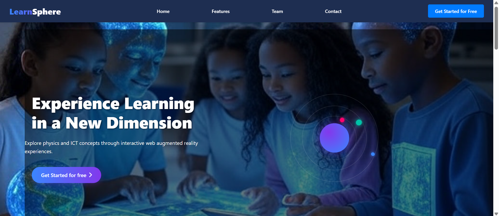

# 🌐 LearnSphere – ICT & Physics



An open-source Web Augmented Reality (WebAR) project designed to bring STEM education to life! This tool allows students and educators to explore Physics and ICT simulations directly in their browser using WebXR.

## 🔬 What It Offers
- 📱 Marker or markerless WebAR support
- ⚙️ Drag-and-drop 3D models for interactive simulations
- 🧲 Realistic physics behavior: gravity, collisions, electric circuits
- 🖥️ ICT activities like assembling a computer in AR
- 🎓 Educational content aligned with school curricula

## 🌟 Technologies Used
- [Three.js](https://threejs.org/)
- [A-Frame](https://aframe.io/)
- [AR.js](https://github.com/AR-js-org/AR.js)
- [WebXR](https://immersive-web.github.io/webxr/)
- JavaScript, HTML, CSS

## 📦 Installation

```bash
git clone https://github.com/vizziona/learnSphere.git
cd learnSphere
npm install
npm start

```

## THANKS AND APPRECIATION

We truly Appreciate University of Rwanda for Giving us Space and Opportunity to start this, and we believe this is gate to open thinkers to bring new big changes here in 
Web AR and build Tech World we wish . Thanks.

## TEAM 

1. NDAYISHIMIYE Bonheur
   Email: ndayibonheur06@gmail.com
2. UWINEZA Ange Marie
   Email: uwineza.angemarie@gmail.com
3. UWIBAMBE Sandrine
    Email: uwibambesandrine@gmail.com

         😍🧑‍💻
